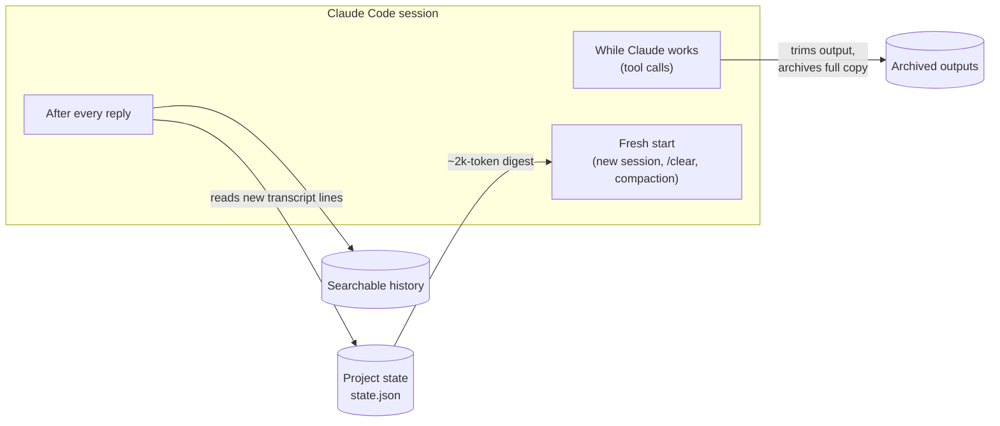

# ctxlc — Complete Overview

ctxlc keeps long Claude Code sessions cheap without making Claude forget the project. It quietly saves your requirements, decisions, current task and open bugs as you work, trims bulky tool output before Claude reads it, and restores exactly what matters (about 2,000 tokens) whenever a conversation starts fresh, is compacted, or moves to another model. It is pure Python, makes no model calls of its own, and runs as Claude Code hooks plus a small in-app status bar.

## The problem it solves

Every message you send makes Claude re-read the whole conversation, so a long session gets more expensive with every turn. Anthropic's prompt cache makes those re-reads cheap (about a tenth of the normal price), but only while the cache is warm. After a break longer than the cache lifetime (5 minutes to 1 hour), or after switching models, the entire conversation has to be written into the cache again at full price.

Measured on 33 real sessions (4,408 requests) on the machine where ctxlc was built:

| Finding | Number |
| --- | --- |
| Share of input tokens that are re-reads of the existing context | 96.9 % |
| Largest sessions' context size | 425k – 597k tokens |
| Share of expensive cache writes caused by full rebuilds (break or model switch) | 77.4 % |
| One model switch at 306k context | 306,736 tokens rewritten |
| One resume after an 8-hour break | 481,241 tokens rewritten |

So cost is driven by two things: how big the context is on each request, and how often the whole context is rebuilt. A shorter summary helps only if it shrinks one of those.

The usual workarounds each lose something. `/clear` makes Claude forget the project. `/compact` (and automatic compaction) replaces the history with a summary that often paraphrases or drops rules you stated hours ago. Switching models re-sends everything. ctxlc removes that trade-off: you can start fresh cheaply and Claude still knows the rules, decisions and task.

## How it works at a glance

ctxlc hooks into three moments of a Claude Code session. While Claude works, it trims tool output and archives the full copy. After every reply, it reads the new part of the conversation and updates the project state and history. At every fresh start (new session, `/clear` or compaction), it injects a compact digest of that state, so Claude picks up where you left off.

## What happens automatically

Once installed, you run nothing. These run on their own in every session:

1. **It saves the project's state after every reply.** ctxlc reads only the new part of the conversation and updates a small state file (`.claude/context/state.json`) with:
   - your **requirements and constraints**, picked up from how you talk ("must…", "never…", "keep it out of…", "I can't stand…"), ignoring quoted text
   - **decisions**, including ones that replace earlier decisions (the old one is marked superseded, not deleted)
   - the **current task**, the files edited and read, and your recent messages
   - **failing commands** and their key error lines; a failure is closed automatically when the same command later passes, or when you say you fixed it
   - the **defining brief** (your first long description of the project)
2. **It trims bulky tool output before Claude reads it.** Command output over 6,000 characters is replaced by a short extract: the start, every error, warning and summary line with context, the end, repeated lines folded ("×4000 similar lines"), and diffs as per-file stats. The full text is kept on disk with its path shown, so nothing is lost. Example: 182,893 characters of log became 432.
3. **It skips repeats.** Identical output seen earlier in the same context, or a re-read of a file that hasn't changed, becomes a short pointer instead of a second copy.
4. **It lets failing builds and tests show their errors.** Claude Code normally shows only the first ~10,000 characters of a failing command, often missing the actual error. ctxlc wraps test/build/install commands so the error lines are extracted instead.
5. **It protects compaction.** Just before Claude summarises a long conversation, ctxlc hands the summariser the list of what it will restore (for example "R3 (requirement)…", "D2 (decision)…") and asks it to spend the summary on what ctxlc can't see: the step in progress, approaches ruled out and why, the next action. Right after, it re-injects the exact rules, so they survive word for word.
6. **It restores state at every fresh start.** When a session starts, is cleared or is compacted, ctxlc injects a compact digest (about 0.5–2.5k tokens): task, handoff note, brief, requirements, decisions, open bugs, config, last status, recent messages and recently modified files. When everything doesn't fit, items most related to the current task win over merely recent ones.
7. **It warns before an expensive move.** If you return to a large conversation whose cache has expired, or are about to switch models on a large warm conversation, ctxlc pauses once and says what continuing would cost and what the cheaper path is. Sending the same message again goes ahead.
8. **It keeps everything searchable.** Every prompt, reply, tool call, compaction summary and archived output goes into a local history you can search (`ctx search`), including superseded decisions, clearly labelled.

Claude can also add notes itself with one-line commands (for example `ctx note decision "Use Postgres" --supersedes D2`), but nothing depends on it remembering to: the automatic layer carries the load.

## What you see in the app

In the Claude desktop app's Code tab (and the Claude Code terminal), ctxlc stays out of the way and speaks up only when acting would save money.

- **Status line, always visible.** A single quiet line under the prompt box, for example: `ctxlc · 123k context · cache warm 48m left · 21 rules saved · /ctxlc`. It tells you how big the conversation is, whether the cache is still warm and how long it has left, and how much project knowledge is saved.
- **A hint above the prompt, only when it pays to act.** It appears in two cases:
  - you come back to a large conversation (60k tokens or more) whose cache has expired, so your next message would re-read all of it at full price;
  - the context is 80 % full or more, so automatic compaction is close.

  The hint says what each path costs and offers **Start fresh** (saves state and starts a clean conversation in one click), **Compact instead** (when nearly full) and **Continue here** (dismiss). After a break, Start fresh deliberately asks Claude for nothing first: writing a summary would itself re-read the whole cold conversation, which is the cost being avoided.
- **The `/ctxlc` pane.** Type `/ctxlc` to open a side pane showing context size and cache state, the current task, counts of saved requirements and decisions, open issues (each with a Resolve button), and buttons for Start fresh, Save handoff and Compact.
- **Past conversations.** The same pane lists the project's earlier conversations, newest first, each labelled by its first message. Click one to read it right in the pane (your prompts and Claude's replies in full, tool calls folded to one line), or open it as a page. Conversations are never deleted by `/clear`; this is how you get back to them.

There is also a `ctx` chat skill (type `ctx panel`, `ctx reset`, `ctx search …` and so on) that shows a control panel inside the chat. The status line and pane replace it for everyday use.

## Everyday situations

| Situation | What to do | What ctxlc does |
| --- | --- | --- |
| Coming back after hours or days | Start a **new session** in the same folder (or click Start fresh) | The new session starts from the ~2k-token digest instead of re-reading the whole old conversation. The old chat stays in your session list, readable any time. |
| You keep typing in the old chat after a break | Nothing; read the warning | Your first message is held once with the cost (for example "idle 15.2h, re-caches ~480k tokens"). Send it again to continue anyway. |
| Switching models mid-project | Start fresh, then pick the new model | Before a switch on a large warm conversation, ctxlc asks first and names the cheaper path. The new model starts from the digest, not a full re-send. |
| One session running for hours or days | Nothing | Output trimming slows growth; when compaction happens (automatic or `/compact`), the exact rules are re-injected afterwards. |
| Mid-task and the context is nearly full | Click Compact instead, or `/compact` | Compaction keeps your in-progress reasoning; ctxlc makes sure the rules survive it. |
| Want to reread an old conversation | `/ctxlc`, then Past conversations (or `ctx history`) | Lists every conversation in the project, including ones before a `/clear`, and opens any one as a readable page. |
| Want to find something from long ago | `ctx search <words>` | Searches all saved history, decisions and archived output locally. |
| Working in Cowork | Upload the plugin once | Works inside each Cowork task. Optionally carries state between tasks through a file in the task's project folder. |

**Rule of thumb:** start fresh when switching to new work or after a break (cheapest); use `/compact` mid-task when the reasoning in flight matters. In a benchmark, continuing from ctxlc's digest cost $0.020 against $0.507 for `/compact`, and both answered all 13 recall questions correctly.

## Where it works

| Where | Status | Notes |
| --- | --- | --- |
| Claude Code CLI (`claude`) | Works | Verified with live sessions and benchmarks |
| Claude desktop app, Code tab | Works, including the status line, hint and `/ctxlc` pane | ctxlc was built and used day to day here |
| VS Code extension | Works (hooks) | Uses the same settings file; the chat panel itself was not driven by hand |
| Cowork (desktop app and claude.ai) | Works as an uploaded plugin | Verified in real Cowork tasks: state restored at task start, large output condensed (182,893 to 432 characters). Each task starts with an empty sandbox; carrying state between tasks goes through a file in the task's project folder and costs a few thousand tokens per copy |
| claude.ai chat and mobile | Not supported | No hooks and no file access. Closest substitute: copy `ctx digest` into a Project's instructions |

Requirements: macOS or Linux, Python 3.9 or newer. Windows is not supported (ctxlc uses `fcntl` file locking).

## Install, update and remove

ctxlc is not on PyPI yet; install it straight from GitHub.

1. **Install the tool:** `pipx install git+https://github.com/Harmantaj/ctxlc.git` (or `pip install --user git+https://github.com/Harmantaj/ctxlc.git`). A clone also works without installing, through its `bin/ctx`.
2. **Turn it on:** `ctx install --global` for every project, or `ctx install --project /path/to/project` for one. This adds ctxlc's hooks to Claude Code's settings (backing the file up first, and refusing to touch a settings file that isn't valid JSON), installs the `ctx` skill, and installs the in-app status line and `/ctxlc` pane.
3. **Start a new session.** Hooks load when a session starts.
4. **For Cowork:** download `ctxlc-plugin.zip` from the [latest GitHub release](https://github.com/Harmantaj/ctxlc/releases/latest) (or build it with `ctx plugin --out ctxlc-plugin.zip`) and upload it in Claude under **Customize → Plugins**. A rebuilt plugin must carry a higher version number, or Cowork keeps the old copy. The plugin can also load in your local Claude Code sessions; since 0.1.3 it stands down there when the global install is present, so nothing runs twice.

To update, run `pipx install --force git+https://github.com/Harmantaj/ctxlc.git` and then `ctx install` again. To remove, run `ctx uninstall --global` (or `--project …`): it removes only ctxlc's hooks, skill and status line, and keeps your saved project state in `.claude/context/`.

Settings can be tuned per project in `.claude/context/config.json` (thresholds, guards on or off). For example, `ctx install --window 300000` makes automatic compaction start earlier; by default ctxlc leaves the compaction point alone so large-context models keep their whole window.

## Commands

You rarely need these; the hooks and the app UI cover daily use.

| Command | What it does |
| --- | --- |
| `/ctxlc` | Opens the in-app pane: state, open issues, Start fresh, Compact, past conversations |
| `ctx history` | Lists the project's past conversations, newest first |
| `ctx history 3 --open` | Opens conversation 3 as a readable page (`--md` for Markdown, `--json` for tools) |
| `ctx search <words>` | Searches all saved history, decisions and archived output |
| `ctx show <ref>` | Shows one history entry, item (for example `D3`) or archived output in full |
| `ctx digest` | Shows exactly what gets injected at a fresh start |
| `ctx state [--all]` | Lists every saved item, including superseded ones with `--all` |
| `ctx note <kind> "<text>"` | Records a requirement, constraint, decision, bug, issue, config or note (`--supersedes D2` to replace one) |
| `ctx task "<text>"` | Sets the current task |
| `ctx resolve <ID>` | Closes a bug or issue |
| `ctx handoff "<text>"` | Saves a note for the next fresh start (what's in progress, the next step) |
| `ctx status [--json]` | Context size, cache state and saved-state summary |
| `ctx report` | Actual token usage per session, plus what ctxlc saved |
| `ctx install` / `ctx uninstall` | Turns ctxlc on or off (`--global` or `--project`) |
| `ctx plugin --out ctxlc-plugin.zip` | Builds the Cowork plugin |

In chat, the same actions are available as messages starting with `ctx` (for example `ctx reset` for a smart reset, `ctx switch` before a model change).

## Measured results

In live A/B runs of real Claude Code sessions, ctxlc cut token cost by about half on tool-heavy work, model switches and resumes after a break, with no loss in what Claude remembered. Cost is in input-token equivalents (cache reads count 0.1×, cache writes 2×, output 5×).

| Workload | Without ctxlc | With ctxlc | Change | Recall (without / with) |
| --- | --: | --: | --: | --- |
| Tool-heavy: failing build, 200k-character lint, failing tests, a file read twice (3 runs) | 711,904 | 379,034 | −47 % | 13/13 / 13/13 |
| Model switch, Haiku work (69k context) then Sonnet | 191,037 | 97,119 | −49 % | 6/6 / 6/6 |
| Resume a large session (123k) after the cache expired | 249,064 | 68,536 | −72 % | 6/6 / 6/6 |
| Resume a medium session (71k) after the cache expired | 145,824 | 72,709 | −50 % | 6/6 / 6/6 |
| Resume a small session (45k) after the cache expired | 93,504 | 71,609 | −23 % | 6/6 / 6/6 |
| Resume a small session while the cache is still warm | 7,696 | 22,486 | +192 % | — |

The last row is why ctxlc only suggests a fresh start when the cache is cold and the conversation is over 60k tokens: with a warm cache, simply continuing is cheaper.

A second benchmark planted 13 facts in a 71k-token session (a casual preference, a reversed decision, a rejected approach, a bug the user said was fixed, an error buried in a 4,000-line build log, an exact column order) and compared ways of continuing, 3 runs each:

| Way of continuing | Score | Cost per continuation |
| --- | --- | --: |
| ctxlc digest only | 13, 13, 13 | $0.020 |
| Resume the full conversation | 13, 13, 13 | $0.225 |
| ctxlc plus a summary Claude writes | 13, 13, 13 | $0.249 |
| Claude writes a HANDOFF.md, a fresh session reads it | 12, 13, 13 | $0.264 |
| `/compact`, then continue | 13, 13, 13 | $0.507 |

Overhead: about 30 ms per hook call, under 0.05 s to process an 8 MB transcript, and no model calls of its own. On a synthetic 3,000-turn, 30 MB session with 400 requirements, the rule relevant to the last question, stated in the first 1 % of the session, was still in the restored digest.

Caveats: one synthetic project per benchmark, Haiku and Sonnet only, 1–3 runs per row.

## Storage and privacy

Everything stays on your machine, in the project's `.claude/context/` folder. Nothing is sent anywhere, and ctxlc makes no API calls.

- The folder is excluded from git and readable only by you, because archived output can contain whatever commands printed, including secrets.
- Archived outputs older than 14 days are deleted at session start, and the history file is trimmed to its newest half once it passes 20 MB. Saved requirements and decisions are never deleted.
- Conversations themselves are Claude Code's own transcripts in `~/.claude/projects/`; ctxlc only reads them.
- In Cowork, state lives inside the task's sandbox, never in the `outputs` folder you get back.

## Limitations

- **It can't shrink a live conversation by itself.** Hooks can't delete past messages; only a fresh start or compaction makes the context smaller. In the desktop app the Start fresh and Compact buttons do it in one click; elsewhere (terminal `-p` runs, VS Code panel, Cowork) you type `/clear` or `/compact`.
- **Rule detection is pattern-based.** It catches phrasing like "must", "never", "I'd rather"; a decision phrased without such cues can be missed, and a pasted log containing "you must…" can be recorded as a requirement.
- **Some failures stay truncated.** Failing commands outside the recognised build/test/install families still reach Claude as Claude Code's ~10,000-character head.
- **Not all output is trimmed.** Grep, web fetches and most MCP tool output pass through unchanged; images and screenshots are deliberately left alone.
- **The fixed prefix is out of reach.** Claude Code's system prompt and tool definitions (16k–68k tokens per request) are outside ctxlc's control.
- **Cowork between tasks depends on the model.** Copying state to the project folder goes through Claude and costs tokens; folder access must be approved per task.
- **macOS and Linux only.**
